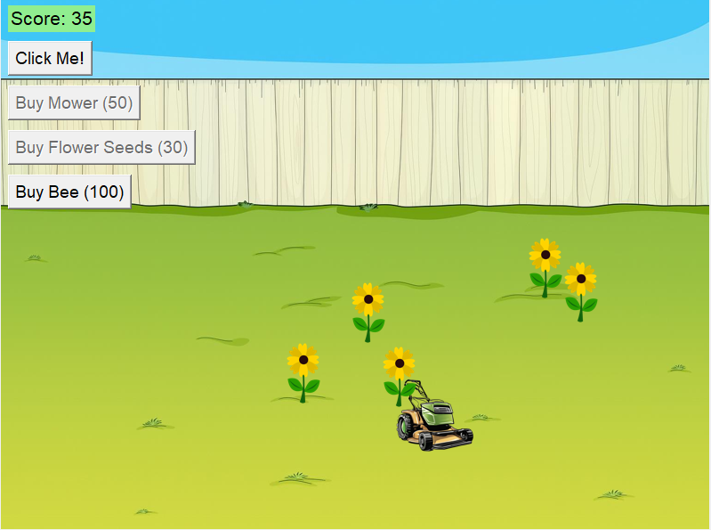

# Garden Clicker Game



This is a fun little clicker game made with Python and Tkinter. You click to earn points and use those points to unlock upgrades like a mower, flowers, and a bee that fly across the screen.

---

## How to Play

- Click the **Click Me!** button to earn points.
- Buy a **Mower** for 50 points — it rolls across the garden and gives you more points.
- Buy **Flower Seeds** for 30 points — flowers will grow, and you can click them for extra points.
- Buy a **Bee** for 100 points — it flies in a wavy path and gives points when it finishes flying.
- More upgrades soon to follow
---

## What You Need

- Python 3
- Pillow library (for images)

To install Pillow, run:

```bash
pip install Pillow
```

---

## Getting Started

Download or clone this project.

Run the game:

```bash
python clicker.py
```


## Made By

Mack Wessels

Hope you enjoy growing your garden!
